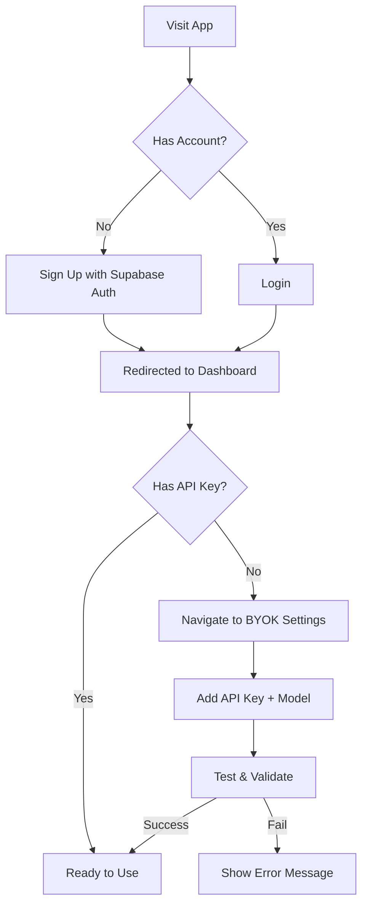

# 🧑‍💻 Developer Context - Smart Documentation System

**Last Updated:** February 2026  
**Status:** Active Development  
**Version:** 1.0 (MVP Complete)

---

## 📖 Table of Contents

1. [Problem Statement](#-problem-statement)
2. [Solution Overview](#-solution-overview)
3. [Architecture](#-architecture)
4. [Tech Stack Deep Dive](#-tech-stack-deep-dive)
5. [Project Structure](#-project-structure)
6. [Core Workflows](#-core-workflows)
7. [Database Schema](#-database-schema)
8. [API Design](#-api-design)
9. [AI/LLM Integration](#-aillm-integration)
10. [Security Implementation](#-security-implementation)
11. [Frontend Architecture](#-frontend-architecture)
12. [Backend Architecture](#-backend-architecture)
13. [Key Implementation Details](#-key-implementation-details)
14. [Environment Setup](#-environment-setup)
15. [Deployment Considerations](#-deployment-considerations)
16. [Known Limitations](#-known-limitations)
17. [Future Enhancements](#-future-enhancements)

---

## 🎯 Problem Statement

### The Challenge

Organizations frequently work with semi-structured documents (certificates, approval letters, request forms, reports) that follow templates but require variable content changes — names, dates, amounts, etc.

**Current Pain Points:**
- **Manual editing** is time-consuming and error-prone
- **Mail merge tools** require manual placeholder setup (`{{name}}`, `{{date}}`)
- **Formatting breaks** when copying/pasting content
- **No intelligent understanding** of document structure
- **Difficult to scale** for hundreds of documents

### Research Gap

From literature survey (see `PRESENTATION.md`):
- Existing systems rely on predefined placeholders
- No automatic variable detection from raw documents
- Poor formatting preservation in programmatic text replacement
- Limited focus on end-to-end document workflows

---

## 💡 Solution Overview

**Entity** (Smart Documentation System) bridges this gap by:

1. **AI-Powered Schema Discovery**  
   Uses LLMs to analyze raw `.docx` files and automatically suggest editable fields

2. **Format-Preserving Replacement**  
   Replaces text while maintaining Word document formatting at the run/table/paragraph level

3. **Event-Based Organization**  
   Groups templates and workflows by events (conferences, projects, etc.)

4. **Automated Reporting**  
   Generates consolidated Excel reports by extracting data across multiple documents

5. **BYOK Security**  
   Users bring their own LLM API keys with full encryption and audit trails

---

## 🏗️ Architecture

### High-Level System Design

```
┌─────────────────────────────────────────────────────────────┐
│                        CLIENT LAYER                          │
│  ┌──────────────────────────────────────────────────────┐  │
│  │  React 19 Frontend (Vite + Tailwind)                 │  │
│  │  - Pages: Login, Dashboard, Uploads, Schema, Reports │  │
│  │  - Services: API, Storage, AI                        │  │
│  └──────────────────────────────────────────────────────┘  │
└───────────────────────┬─────────────────────────────────────┘
                        │ HTTPS/JWT
┌───────────────────────▼─────────────────────────────────────┐
│                     API GATEWAY LAYER                        │
│  ┌──────────────────────────────────────────────────────┐  │
│  │  FastAPI Server (Python 3.10+)                       │  │
│  │  - Authentication Middleware                          │  │
│  │  - Request Validation (Pydantic)                     │  │
│  │  - CORS Configuration                                 │  │
│  └──────────────────────────────────────────────────────┘  │
└───────────────────────┬─────────────────────────────────────┘
                        │
        ┌───────────────┼───────────────┐
        │               │               │
┌───────▼────────┐ ┌───▼────────┐ ┌────▼───────┐
│   AI LAYER     │ │ LOGIC LAYER│ │  DATA LAYER│
│ ┌────────────┐ │ │  Document  │ │  Supabase  │
│ │ LangGraph  │ │ │  Replace   │ │  - Auth    │
│ │ - Schema   │ │ │  DOCX Tool │ │  - Postgres│
│ │   Discovery│ │ │  Extract   │ │  - Storage │
│ │ - Report   │ │ │  Excel     │ │  - RLS     │
│ │   Agent    │ │ │  Generator │ │            │
│ └────────────┘ │ │  BYOK Enc. │ │  Redis     │
│                │ │            │ │  (optional)│
└────────────────┘ └────────────┘ └────────────┘
        │
┌───────▼────────────────────┐
│   EXTERNAL LLM PROVIDERS   │
│  - OpenAI (GPT-4o, etc.)   │
│  - Google (Gemini)         │
│  - Groq (Llama)            │
└────────────────────────────┘
```

### Data Flow

#### 1. Schema Discovery Flow
```
User selects documents → Upload to Supabase Storage → 
Extract Markdown (MarkItDown) → 
LangGraph Workflow:
  1. Cache Check
  2. Map Discovery (per-document)
  3. Merge Schemas
  4. LLM Consolidation
  5. Frequency + Location Computation
  6. Cache Store →
Frontend renders Fields/Stats/Tables
```

#### 2. Document Replacement Flow
```
User edits field values → 
Backend fetches original DOCX from storage →
Python-DOCX parses document →
replace.py performs run-level text replacement →
Preserve formatting (font, style, color) →
Upload modified DOCX to storage →
Return signed download URL
```

#### 3. Report Generation Flow
```
User selects date range + columns →
Fetch events in range →
For each event:
  - Load documents
  - Extract data via LLM
  - Handle missing columns
  - Skip events with 0 documents →
Generate Excel using openpyxl →
Return file with summary
```

---

## 🔧 Tech Stack Deep Dive

### Frontend Stack

| Package | Version | Purpose |
|---------|---------|---------|
| `react` | 19.2.0 | UI framework (with new hooks) |
| `react-router-dom` | 7.11.0 | Client-side routing |
| `@tailwindcss/vite` | 4.1.17 | Styling (Tailwind v4) |
| `@supabase/supabase-js` | 2.87.1 | Auth + Storage client |
| `lucide-react` | Latest | Icon system |
| `react-markdown` | 10.1.0 | Markdown preview |
| `@react-pdf-viewer/*` | 3.12.0 | PDF viewing |
| `vite` | rolldown-vite@7.2.5 | Ultra-fast bundler |

**Why Vite (Rolldown)?**  
Rolldown is a Rust-based bundler that's 10x faster than traditional Vite. Used for instant HMR during development.

**Why React 19?**  
New hooks like `use()` and improved concurrent rendering for better UX.

### Backend Stack

| Package | Purpose |
|---------|---------|
| `fastapi` | High-performance async web framework |
| `uvicorn` | ASGI server |
| `pydantic` | Request/response validation |
| `langchain` | LLM orchestration framework |
| `langgraph` | Multi-agent AI workflows |
| `langchain-openai` | OpenAI integration |
| `langchain-google-genai` | Gemini integration |
| `langchain-groq` | Groq integration |
| `python-docx` | DOCX file manipulation |
| `markitdown[all]` | Document → Markdown conversion |
| `supabase` | Supabase Python client |
| `PyJWT` | JWT token verification |
| `cryptography` | AES encryption for API keys |
| `redis` | Optional caching layer |
| `openpyxl` | Excel file generation |
| `rapidfuzz` | Fuzzy string matching |
| `tiktoken` | Token counting |

**Why FastAPI?**  
- Automatic OpenAPI docs (`/swagger`)
- Type safety with Pydantic
- Async/await support for high concurrency
- Built-in dependency injection

**Why LangGraph?**  
- Stateful multi-step AI workflows
- Better than LangChain's legacy chains
- Enables caching, branching, and parallel execution

---

## 📁 Project Structure

```
Smart Documentation System/
│
├── backend/
│   ├── server.py                 # Main FastAPI app, all routes
│   ├── schemaAgent.py            # LangGraph workflow for schema discovery
│   ├── byok_service.py           # API key retrieval and LLM instantiation
│   ├── byok_encryption.py        # AES-256-GCM encryption utilities
│   ├── byok_providers.py         # Provider adapters (OpenAI, Gemini, Groq)
│   ├── byok_endpoints.py         # BYOK REST API routes
│   ├── report_service.py         # Report generation logic
│   ├── report_agent.py           # LLM-based data extraction for reports
│   ├── storage_service.py        # Supabase client instantiation
│   ├── replace.py                # DOCX text replacement engine
│   ├── extract.py                # Markdown extraction from DOCX
│   ├── extract_tables.py         # Table extraction from DOCX
│   ├── excel_generator.py        # Excel report generation
│   ├── convert_to_pdf.py         # DOCX → PDF conversion
│   ├── generate_master_key.py    # Utility to generate encryption key
│   ├── test_byok_enforcement.py  # BYOK tests
│   ├── requirements.txt          # Python dependencies
│   ├── .env.example              # Environment variables template
│   ├── migrations/               # SQL migration files
│   │   ├── 001_initial_schema.sql
│   │   └── 002_byok_tables.sql
│   └── tests/                    # Unit tests
│
├── frontend/
│   ├── src/
│   │   ├── main.jsx              # App entry point
│   │   ├── App.jsx               # Root component with routing
│   │   ├── index.css             # Global styles
│   │   │
│   │   ├── pages/                # Top-level pages
│   │   │   ├── Login.jsx         # Auth page
│   │   │   ├── Dashboard.jsx     # Event list view
│   │   │   ├── Uploads.jsx       # Document upload page
│   │   │   ├── SchemaDiscovery.jsx  # Main AI workflow UI
│   │   │   ├── Reports.jsx       # Reports wrapper
│   │   │   ├── BYOKSettings.jsx  # API key management
│   │   │   └── PreviewPage.jsx   # Document preview
│   │   │
│   │   ├── components/           # Reusable components
│   │   │   ├── Auth.jsx          # Auth state management
│   │   │   ├── EventList.jsx     # Event cards
│   │   │   ├── FieldCard.jsx     # Schema field editor
│   │   │   ├── FieldsTab.jsx     # Fields list view
│   │   │   ├── StatsTab.jsx      # Schema statistics
│   │   │   ├── TablesTab.jsx     # Extracted tables
│   │   │   ├── MarkdownPreview.jsx  # Markdown viewer
│   │   │   ├── EditableTable.jsx # Table editor
│   │   │   ├── ConfirmModal.jsx  # Confirmation dialogs
│   │   │   ├── ErrorBoundary.jsx # Error handling
│   │   │   ├── SideMenu.jsx      # Navigation
│   │   │   ├── logo.jsx          # App logo
│   │   │   └── Report/
│   │   │       ├── ColumnConfig.jsx  # Report column management
│   │   │       └── UnresolvedFallback.jsx  # Missing data handler
│   │   │
│   │   ├── services/             # API abstraction
│   │   │   ├── aiService.js      # Schema discovery API
│   │   │   ├── eventService.js   # Event CRUD
│   │   │   ├── documentService.js  # Document operations
│   │   │   ├── reportService.js  # Report generation
│   │   │   ├── byokService.js    # BYOK management
│   │   │   ├── previewService.js # Document preview
│   │   │   └── replacementService.js  # Text replacement
│   │   │
│   │   ├── config/
│   │   │   └── api.js            # Supabase + API config
│   │   │
│   │   ├── contexts/
│   │   │   └── ToastContext.jsx  # Toast notifications
│   │   │
│   │   ├── hooks/
│   │   │   └── useAuth.js        # Auth hook
│   │   │
│   │   └── utils/
│   │       └── helpers.js        # Utility functions
│   │
│   ├── package.json
│   ├── vite.config.js
│   └── tailwind.config.js
│
├── example-docs/                 # Sample DOCX files for testing
├── BYOK_ENFORCEMENT.md           # BYOK architecture docs
├── PRESENTATION.md               # Project presentation script
├── README.md                     # User-facing documentation
├── DEV_CONTEXT.md                # This file
└── .gitignore
```

---

## 🔄 Core Workflows

### Workflow 1: User Onboarding



### Workflow 2: Schema Discovery (Core Feature)

**Step-by-Step:**

1. **User Selects Documents**  
   - Frontend: `SchemaDiscovery.jsx` → Select checkboxes
   - State: `selectedDocIds: ['id1', 'id2', ...]`

2. **Optional: Add Instructions**  
   - User inputs natural language instructions
   - Example: "Extract speaker names, session times, and room numbers"

3. **Trigger Discovery**  
   - Click "Discover Schema" button
   - Frontend calls `aiService.discoverSchema(eventId, docIds, instructions)`

4. **Backend Processing** (in `server.py:discover_schema`)  
   ```python
   # 1. Get user's LLM
   llm, metadata = byok_service.get_llm_for_user(user_id, provider, model, jwt_token)
   
   # 2. Fetch documents from Supabase
   docs = storage_service.get_documents(event_id, doc_ids)
   
   # 3. Prepare input for LangGraph
   documents = [(doc.name, doc.markdown_content) for doc in docs]
   
   # 4. Run LangGraph workflow
   result = schema_discovery_workflow.invoke({
       'documents': documents,
       'user_instructions': instructions,
       'llm_instance': llm
   })
   
   # 5. Return schema
   return result['final_schema']
   ```

5. **LangGraph Workflow** (in `schemaAgent.py`)  
   ```
   [START]
     ↓
   [cache_check] → If cached, return immediately
     ↓
   [map_discover_schema] → Per-document LLM extraction
     ↓
   [merge_schemas_enhanced] → Structural merge
     ↓
   [consolidate_entities_llm] → LLM deduplication
     ↓
   [compute_frequencies_and_locations] → Markdown highlighting
     ↓
   [cache_store] → Save to Redis/memory
     ↓
   [END]
   ```

6. **Frontend Renders Results**  
   - Fields Tab: List of discovered fields
   - Stats Tab: Token usage, timing, caching
   - Tables Tab: Extracted table data
   - Markdown Preview: Highlighted references

### Workflow 3: Document Replacement

1. User edits field values in `FieldCard.jsx`
2. Clicks "Generate Documents"
3. Frontend: `replacementService.updateTemplate(docId, variables)`
4. Backend: `server.py:replace_text`
   - Downloads original DOCX from Supabase
   - Calls `replace.py:replace_text_in_docx()`
   - **Run-level replacement** to preserve formatting
   - Uploads modified DOCX
   - Returns signed URL
5. User downloads generated document

### Workflow 4: Report Generation

1. User configures columns in `ColumnConfig.jsx` (drag-reorder supported)
2. Selects date range (start_date, end_date)
3. Clicks "Generate Report"
4. Backend: `report_service.generate_report_preview()`
   - Fetch events in date range
   - For each event:
     - Check document count (skip if 0)
     - Load documents
     - Extract column data via `report_agent.py`
   - Return: `{valid_rows, unresolved_events, skipped_events}`
5. Frontend shows summary modal
6. User clicks "Download Excel"
7. Backend generates Excel using `openpyxl`

---

## 🗄️ Database Schema

### Supabase Tables

#### `events`
```sql
CREATE TABLE events (
    id UUID PRIMARY KEY DEFAULT gen_random_uuid(),
    user_id UUID NOT NULL REFERENCES auth.users(id),
    name TEXT NOT NULL,
    description TEXT,
    event_date DATE,
    created_at TIMESTAMPTZ DEFAULT NOW(),
    updated_at TIMESTAMPTZ DEFAULT NOW()
);

-- RLS Policy: Users can only access their own events
```

#### `templates`
```sql
CREATE TABLE templates (
    id UUID PRIMARY KEY DEFAULT gen_random_uuid(),
    user_id UUID NOT NULL REFERENCES auth.users(id),
    event_id UUID REFERENCES events(id) ON DELETE CASCADE,
    name TEXT NOT NULL,
    path TEXT NOT NULL,  -- Supabase storage path
    markdown_content TEXT,  -- Extracted markdown
    tables JSONB,  -- Extracted tables
    variables JSONB,  -- Discovered fields
    uploaded_at TIMESTAMPTZ DEFAULT NOW()
);
```

#### `llm_api_keys` (BYOK)
```sql
CREATE TABLE llm_api_keys (
    id UUID PRIMARY KEY DEFAULT gen_random_uuid(),
    user_id UUID NOT NULL REFERENCES auth.users(id),
    provider TEXT NOT NULL,  -- 'openai', 'gemini', 'groq'
    model TEXT,  -- Optional model selection
    encrypted_key TEXT NOT NULL,  -- AES-256-GCM encrypted
    key_fingerprint TEXT NOT NULL,  -- SHA256 hash for deduplication
    status TEXT DEFAULT 'active',  -- 'active', 'revoked'
    last_used_at TIMESTAMPTZ,
    last_validated_at TIMESTAMPTZ,
    created_at TIMESTAMPTZ DEFAULT NOW(),
    updated_at TIMESTAMPTZ DEFAULT NOW(),
    UNIQUE(user_id, provider)
);
```

#### `llm_key_audit_logs`
```sql
CREATE TABLE llm_key_audit_logs (
    id UUID PRIMARY KEY DEFAULT gen_random_uuid(),
    user_id UUID NOT NULL,
    provider TEXT NOT NULL,
    model TEXT,
    action TEXT NOT NULL,  -- 'created', 'rotated', 'validated', 'revoked'
    created_at TIMESTAMPTZ DEFAULT NOW()
);
```

#### `report_columns`
```sql
CREATE TABLE report_columns (
    id UUID PRIMARY KEY DEFAULT gen_random_uuid(),
    user_id UUID NOT NULL REFERENCES auth.users(id),
    columns JSONB NOT NULL,  -- [{ name, description, order }]
    created_at TIMESTAMPTZ DEFAULT NOW(),
    updated_at TIMESTAMPTZ DEFAULT NOW(),
    UNIQUE(user_id)
);
```

### Supabase Storage

**Bucket:** Configured via `BUCKET_NAME` env variable

**Structure:**
```
bucket-name/
├── user-{uuid}/
│   ├── event-{event-id}/
│   │   ├── original-document.docx
│   │   ├── generated-document.docx
│   │   └── ...
```

**RLS Policies:**
- Users can only access files in their `user-{uuid}/` directory
- Signed URLs used for temporary access

---

## 🔌 API Design

### Authentication

All endpoints (except public docs) require JWT:
```http
Authorization: Bearer <jwt_token>
```

**Token Extraction:**
```python
def get_jwt_token(authorization: Optional[str] = Header(None)):
    if authorization and authorization.startswith("Bearer "):
        return authorization[7:]
    return None
```

### Error Handling

**Standard Error Response:**
```json
{
  "detail": "Error message",
  "error": "ERROR_CODE",  // Optional
  "action": "suggested_action"  // Optional
}
```

**BYOK-Specific Errors:**
- `BYOK_REQUIRED`: No API key found for user
- `BYOK_SETUP_REQUIRED`: No keys available (user + fallback)

### Key Endpoints

#### `POST /discover-schema`
**Request:**
```json
{
  "event_id": "uuid",
  "document_ids": ["uuid1", "uuid2"],
  "user_instructions": "Optional instructions"
}
```

**Response:**
```json
{
  "success": true,
  "schema": {
    "fields": [
      {
        "name": "Speaker Name",
        "type": "text",
        "references": ["Dr. Smith", "Prof. Jones"],
        "frequency": 5,
        "locations": [
          {
            "document": "doc1.docx",
            "line": 10,
            "start": 50,
            "end": 58,
            "context": "...Dr. Smith will present..."
          }
        ]
      }
    ],
    "tables": [...],
    "stats": {
      "total_tokens": 5000,
      "execution_time_ms": 2500,
      "cached": false
    }
  },
  "key_source": "user"  // or "fallback"
}
```

#### `POST /report/generate`
**Request:**
```json
{
  "start_date": "2024-01-01",
  "end_date": "2024-12-31",
  "columns": [
    {
      "name": "Event Name",
      "description": "Name of the event"
    },
    {
      "name": "Speaker",
      "description": "Main speaker name"
    }
  ]
}
```

**Response:**
```json
{
  "success": true,
  "rows": [
    {
      "S.No": 1,
      "Event Name": "Conference 2024",
      "Event Date": "2024-05-15",
      "Speaker": "Dr. Smith"
    }
  ],
  "unresolved": [
    {
      "event_id": "uuid",
      "event_name": "Workshop",
      "missing_columns": ["Speaker"],
      "documents": [...]
    }
  ],
  "skipped": ["Event with no documents"]
}
```

---

## 🤖 AI/LLM Integration

### LangGraph Workflow Architecture

**File:** `backend/schemaAgent.py`

**State Definition:**
```python
class SchemaDiscoveryState(TypedDict):
    documents: List[Tuple[str, str]]  # [(name, markdown)]
    doc_paths: List[str]  # Optional DOCX paths
    cache_key: Optional[str]
    partial_schemas: List[Dict[str, Any]]
    final_schema: Optional[Dict[str, Any]]
    stats: Dict[str, Any]
    user_instructions: Optional[str]
    user_id: Optional[str]
    jwt_token: Optional[str]
    llm_instance: Optional[Any]  # Injected LLM
```

**Nodes:**

1. **cache_check**  
   - Generates SHA256 hash of input
   - Checks Redis/memory cache
   - If hit, populates `final_schema` and exits early

2. **map_discover_schema**  
   - Iterates over each document
   - Sends markdown + instructions to LLM
   - Prompt structure:
     ```
     You are a document analysis expert. Extract all variable fields from this document.
     
     [User Instructions]
     
     [Markdown Content]
     
     Return JSON: {
       "fields": [{"name": "...", "type": "...", "references": [...]}],
       "tables": [...]
     }
     ```
   - Stores per-document schemas in `partial_schemas`

3. **merge_schemas_enhanced**  
   - Merges all `partial_schemas`
   - Unions field names
   - Aggregates references
   - No semantic deduplication yet

4. **consolidate_entities_llm**  
   - Takes merged schema
   - Sends to LLM for semantic deduplication
   - Prompt:
     ```
     Consolidate these fields. Merge similar entities (e.g., "Speaker Name" and "Presenter" → "Speaker").
     
     [Merged Fields]
     
     Return consolidated JSON.
     ```

5. **compute_frequencies_and_locations**  
   - For each field's references:
     - Search in markdown content
     - Find exact positions (line, char offset)
     - Count frequency
   - Used for frontend highlighting

6. **cache_store**  
   - Stores `final_schema` in cache
   - TTL: 1 hour

**Graph Structure:**
```python
graph = StateGraph(SchemaDiscoveryState)
graph.add_node("cache_check", cache_check)
graph.add_node("map_discover_schema", map_discover_schema)
graph.add_node("merge_schemas", merge_schemas_enhanced)
graph.add_node("consolidate_entities", consolidate_entities_llm)
graph.add_node("compute_frequencies_and_locations", compute_frequencies_and_locations)
graph.add_node("cache_store", cache_store)

graph.set_conditional_entry_point(
    cache_check,
    lambda state: "cache_store" if state['final_schema'] else "map_discover_schema"
)

graph.add_edge("map_discover_schema", "merge_schemas")
graph.add_edge("merge_schemas", "consolidate_entities")
graph.add_edge("consolidate_entities", "compute_frequencies_and_locations")
graph.add_edge("compute_frequencies_and_locations", "cache_store")
graph.add_edge("cache_store", END)
```

### LLM Provider Abstraction

**File:** `backend/byok_providers.py`

**Base Class:**
```python
class LLMProviderAdapter(ABC):
    @abstractmethod
    def validate_key(self, api_key: str, model: Optional[str] = None) -> bool:
        """Validate API key and optional model with real inference call"""
        pass
    
    @abstractmethod
    def create_llm(self, api_key: str, model: str, **options) -> Any:
        """Create LLM instance"""
        pass
```

**Implementations:**
- `OpenAIAdapter` → Returns `ChatOpenAI`
- `GeminiAdapter` → Returns `ChatGoogleGenerativeAI`
- `GroqAdapter` → Returns `ChatGroq`

**Validation Strategy:**
1. Basic check: Call provider's `/models` endpoint
2. Model check (if specified): Invoke LLM with simple prompt ("Hi") and catch errors

**Error Handling:**
```python
try:
    llm.invoke("Hi")
    return True
except Exception as e:
    if "401" in str(e):
        raise ValueError("Invalid API Key")
    elif "404" in str(e):
        raise ValueError(f"Model '{model}' not found")
    else:
        raise e
```

### Caching Strategy

**Why Cache?**
- Schema discovery is expensive (thousands of tokens)
- Same documents often analyzed multiple times
- Improve UX by instant responses

**Implementation:**
1. **Cache Key Generation:**  
   `SHA256(document_contents + user_instructions + provider + model)`

2. **Storage:**
   - **Primary:** Redis (if available)
   - **Fallback:** In-memory Python dict

3. **TTL:** 1 hour (configurable)

4. **Invalidation:**
   - Implicit (TTL expires)
   - Manual (if user changes docs)

---

## 🔒 Security Implementation

### API Key Encryption

**File:** `backend/byok_encryption.py`

**Algorithm:** AES-256-GCM  

**Flow:**
1. User submits API key via `/api/byok` endpoint
2. Backend validates key with actual LLM call
3. Key encrypted using:
   ```python
   from cryptography.hazmat.primitives.ciphers.aead import AESGCM
   
   def encrypt_api_key(api_key: str) -> str:
       nonce = os.urandom(12)  # 96-bit nonce
       cipher = AESGCM(MASTER_KEY)
       ciphertext = cipher.encrypt(nonce, api_key.encode(), None)
       return base64.b64encode(nonce + ciphertext).decode()
   ```
4. Encrypted key stored in `llm_api_keys` table
5. Fingerprint (SHA256 hash) stored for deduplication

**Decryption (only in backend memory):**
```python
def decrypt_api_key(encrypted_key: str) -> str:
    data = base64.b64decode(encrypted_key)
    nonce = data[:12]
    ciphertext = data[12:]
    cipher = AESGCM(MASTER_KEY)
    plaintext = cipher.decrypt(nonce, ciphertext, None)
    return plaintext.decode()
```

**Master Key:**
- Generated once using `generate_master_key.py`
- Stored in `.env` (never committed)
- 32 bytes (256 bits)

**Security Features:**
- Keys never logged
- Keys never returned in API responses
- Decryption happens only during LLM instantiation
- Keys cleared from memory after use

### Row-Level Security (RLS)

**Supabase Policies:**

```sql
-- Events
CREATE POLICY "Users can view their own events"
ON events FOR SELECT
USING (auth.uid() = user_id);

CREATE POLICY "Users can insert their own events"
ON events FOR INSERT
WITH CHECK (auth.uid() = user_id);

-- Templates
CREATE POLICY "Users can view their own templates"
ON templates FOR SELECT
USING (auth.uid() = user_id);

-- BYOK Keys
CREATE POLICY "Users can view only their API keys"
ON llm_api_keys FOR SELECT
USING (auth.uid() = user_id);
```

### JWT Validation

**Flow:**
1. Frontend obtains JWT from Supabase Auth
2. Sends JWT in `Authorization: Bearer <token>` header
3. Backend extracts JWT
4. Creates user-scoped Supabase client:
   ```python
   def get_user_supabase_client(jwt_token: str) -> Client:
       return create_client(
           SUPABASE_URL,
           SUPABASE_KEY,
           options=ClientOptions(
               headers={"Authorization": f"Bearer {jwt_token}"}
           )
       )
   ```
5. All DB operations use this client → RLS enforced

---

## 🎨 Frontend Architecture

### State Management

**Approach:** React hooks + prop drilling (no Redux/Zustand)

**Rationale:**
- Small-to-medium app scope
- Most state is page-local
- Shared state (auth) handled by context

**Key Hooks:**
- `useState` - Local component state
- `useEffect` - Data fetching
- `useNavigate` - React Router navigation
- `useAuth` - Custom auth hook

### Component Patterns

**1. Container/Presentational**
```jsx
// Container (SchemaDiscovery.jsx)
const SchemaDiscovery = () => {
  const [schema, setSchema] = useState(null);
  const [loading, setLoading] = useState(false);
  
  const handleDiscover = async () => {
    setLoading(true);
    const result = await aiService.discoverSchema(...);
    setSchema(result.schema);
    setLoading(false);
  };
  
  return <FieldsTab schema={schema} onDiscover={handleDiscover} />;
};

// Presentational (FieldsTab.jsx)
const FieldsTab = ({ schema, onDiscover }) => {
  return (
    <div>
      {schema.fields.map(field => <FieldCard field={field} />)}
      <button onClick={onDiscover}>Discover</button>
    </div>
  );
};
```

**2. Service Layer Abstraction**

All API calls go through service modules:
```javascript
// services/aiService.js
export const discoverSchema = async (eventId, docIds, instructions) => {
  const response = await apiCall('/discover-schema', {
    method: 'POST',
    body: JSON.stringify({ event_id: eventId, document_ids: docIds, user_instructions: instructions })
  });
  return response;
};
```

**Benefits:**
- Easy to mock for testing
- Centralized error handling
- Can add interceptors

**3. Error Boundaries**

```jsx
// ErrorBoundary.jsx
class ErrorBoundary extends React.Component {
  state = { hasError: false, error: null };
  
  static getDerivedStateFromError(error) {
    return { hasError: true, error };
  }
  
  render() {
    if (this.state.hasError) {
      return <div>Something went wrong: {this.state.error.message}</div>;
    }
    return this.props.children;
  }
}
```

### Routing

**File:** `App.jsx`

```jsx
const router = createBrowserRouter([
  {
    path: "/",
    element: <ProtectedRoute><Dashboard /></ProtectedRoute>
  },
  {
    path: "/login",
    element: <Login />
  },
  {
    path: "/event/:eventId",
    element: <ProtectedRoute><SchemaDiscovery /></ProtectedRoute>
  },
  {
    path: "/reports",
    element: <ProtectedRoute><Reports /></ProtectedRoute>
  },
  {
    path: "/settings/byok",
    element: <ProtectedRoute><BYOKSettings /></ProtectedRoute>
  }
]);
```

**ProtectedRoute:**
```jsx
const ProtectedRoute = ({ children }) => {
  const { session, loading } = useAuth();
  
  if (loading) return <div>Loading...</div>;
  if (!session) return <Navigate to="/login" />;
  
  return children;
};
```

### Styling Conventions

**Tailwind Classes:**
- Colors: `slate`, `indigo`, `red`, `green`, `amber`
- Spacing: Consistent use of `gap-{n}`, `p-{n}`, `m-{n}`
- Responsive: `sm:`, `md:`, `lg:` breakpoints

**Custom Scrollbar:**
```css
.custom-scrollbar::-webkit-scrollbar {
  width: 6px;
}
.custom-scrollbar::-webkit-scrollbar-thumb {
  background: rgb(203 213 225);
  border-radius: 3px;
}
```

---

## ⚙️ Backend Architecture

### FastAPI Application Structure

**File:** `server.py`

**Middleware:**
```python
app.add_middleware(
    CORSMiddleware,
    allow_origins=["*"],  # In production, specify frontend domain
    allow_credentials=True,
    allow_methods=["*"],
    allow_headers=["*"],
)
```

**Router Inclusion:**
```python
app.include_router(byok_router)  # From byok_endpoints.py
```

**Dependency Injection:**
```python
@app.post("/discover-schema")
async def discover_schema(
    req: SchemaDiscoveryRequest,
    token: Optional[str] = Depends(get_jwt_token)  # Injected dependency
):
    ...
```

### DOCX Replacement Engine

**File:** `backend/replace.py`

**Core Function:**
```python
def replace_text_in_docx(doc, replacements: Dict[str, str]) -> Document:
    """
    Replace text in DOCX at the run level to preserve formatting.
    
    Handles:
    - Paragraphs
    - Tables
    - Headers/Footers
    - Text boxes
    """
    for paragraph in doc.paragraphs:
        replace_in_paragraph(paragraph, replacements)
    
    for table in doc.tables:
        for row in table.rows:
            for cell in row.cells:
                for paragraph in cell.paragraphs:
                    replace_in_paragraph(paragraph, replacements)
    
    for section in doc.sections:
        replace_in_paragraph(section.header, replacements)
        replace_in_paragraph(section.footer, replacements)
    
    return doc

def replace_in_paragraph(paragraph, replacements):
    """Replace within a paragraph at run level."""
    for old_text, new_text in replacements.items():
        if old_text in paragraph.text:
            # Get full text
            full_text = "".join(run.text for run in paragraph.runs)
            
            if old_text in full_text:
                # Find position
                start_idx = full_text.index(old_text)
                end_idx = start_idx + len(old_text)
                
                # Iterate runs and replace
                current_pos = 0
                for run in paragraph.runs:
                    run_len = len(run.text)
                    
                    if current_pos <= start_idx < current_pos + run_len:
                        # Replacement starts in this run
                        run.text = run.text[:start_idx - current_pos] + new_text
                    elif start_idx < current_pos < end_idx:
                        # Middle run, clear it
                        run.text = ""
                    elif current_pos + run_len > end_idx >= current_pos:
                        # Replacement ends in this run
                        run.text = run.text[end_idx - current_pos:]
                    
                    current_pos += run_len
```

**Why Run-Level?**
- Word stores text in "runs" (continuous formatting)
- Simple string replace breaks formatting
- Must preserve each run's styling

### Report Agent

**File:** `backend/report_agent.py`

**Purpose:** Extract specific column values from documents using LLM

```python
def extract_column_value(
    markdown_content: str,
    column_name: str,
    column_description: str,
    llm
) -> str:
    """
    Use LLM to extract a specific value from markdown.
    """
    prompt = f"""
You are a data extraction assistant. Extract the value for the following field:

Column: {column_name}
Description: {column_description}

Document Content:
{markdown_content}

Return ONLY the extracted value, or "N/A" if not found.
"""
    
    response = llm.invoke(prompt)
    return response.content.strip()
```

**Usage in Report Generation:**
```python
for column in columns:
    if column['name'] not in SYSTEM_COLUMNS:
        value = extract_column_value(
            doc.markdown_content,
            column['name'],
            column['description'],
            llm
        )
        row[column['name']] = value
```

---

## 🔑 Key Implementation Details

### 1. Duplicate Upload Prevention

**Problem:** Users might upload same file twice

**Solution:** Fingerprinting in `storage_service.py`

```python
def check_duplicate(event_id: str, filename: str, jwt_token: str) -> Optional[str]:
    supabase = get_user_supabase_client(jwt_token)
    existing = supabase.table('templates').select('id').eq('event_id', event_id).eq('name', filename).execute()
    
    if existing.data:
        return existing.data[0]['id']
    return None
```

**Flow:**
1. User uploads file
2. Frontend calls `/upload/url` with filename
3. Backend checks for duplicates
4. If exists, return error
5. Else, generate signed URL

### 2. Markdown Location Tracking

**Problem:** How to highlight text in frontend preview?

**Solution:** Store line + character offset

**Function:** `find_reference_locations_in_markdown` in `schemaAgent.py`

```python
def find_reference_locations_in_markdown(
    markdown_content: str,
    reference: str,
    filename: str
) -> List[Dict[str, Any]]:
    locations = []
    lines = markdown_content.split('\n')
    
    for line_idx, line in enumerate(lines):
        start = 0
        while True:
            pos = line.find(reference, start)
            if pos == -1:
                break
            
            context_start = max(0, pos - 20)
            context_end = min(len(line), pos + len(reference) + 20)
            
            locations.append({
                "document": filename,
                "line": line_idx + 1,
                "start": pos,
                "end": pos + len(reference),
                "context": line[context_start:context_end]
            })
            
            start = pos + 1
    
    return locations
```

**Frontend Usage:**
```jsx
<MarkdownPreview
  content={markdown}
  highlights={field.locations.map(loc => ({
    line: loc.line,
    start: loc.start,
    end: loc.end
  }))}
/>
```

### 3. Drag-and-Drop Column Reordering

**Component:** `ColumnConfig.jsx`

**Implementation:**
```jsx
const [draggedItemIndex, setDraggedItemIndex] = useState(null);

const handleDragStart = (e, index) => {
  setDraggedItemIndex(index);
  e.dataTransfer.effectAllowed = "move";
};

const handleDragEnter = (e, index) => {
  if (draggedItemIndex === null || draggedItemIndex === index) return;
  
  const newColumns = [...columns];
  const draggedItem = newColumns[draggedItemIndex];
  
  newColumns.splice(draggedItemIndex, 1);
  newColumns.splice(index, 0, draggedItem);
  
  setColumns(newColumns);
  setDraggedItemIndex(index);
};

const handleDragEnd = () => {
  setDraggedItemIndex(null);
  // Update order field
  const updated = columns.map((col, idx) => ({ ...col, order: idx }));
  setColumns(updated);
};
```

### 4. Fuzzy Field Deduplication

**Problem:** LLM might return "Speaker Name" and "Presenter" as separate fields

**Solution:** Fuzzy matching in `schemaAgent.py`

```python
from rapidfuzz import fuzz

def fuzzy_dedupe_references(references: List[str], threshold: int = 85) -> List[str]:
    """Remove near-duplicate references using fuzzy matching."""
    if not references:
        return []
    
    unique = []
    for ref in references:
        is_duplicate = False
        for existing in unique:
            if fuzz.ratio(ref.lower(), existing.lower()) > threshold:
                is_duplicate = True
                break
        
        if not is_duplicate:
            unique.append(ref)
    
    return unique
```

**Usage:**
```python
field['references'] = fuzzy_dedupe_references(field['references'])
```

### 5. Real-time Toast Notifications

**Context:** `ToastContext.jsx`

```jsx
export const ToastProvider = ({ children }) => {
  const [toasts, setToasts] = useState([]);
  
  const addToast = (message, type = 'info') => {
    const id = Date.now();
    setToasts(prev => [...prev, { id, message, type }]);
    
    setTimeout(() => {
      setToasts(prev => prev.filter(t => t.id !== id));
    }, 3000);
  };
  
  return (
    <ToastContext.Provider value={{ success: (msg) => addToast(msg, 'success'), error: (msg) => addToast(msg, 'error') }}>
      {children}
      <div className="fixed top-4 right-4 z-50">
        {toasts.map(toast => (
          <div key={toast.id} className={`toast toast-${toast.type}`}>
            {toast.message}
          </div>
        ))}
      </div>
    </ToastContext.Provider>
  );
};
```

---

## 🚀 Environment Setup

### Backend `.env` Template

```env
# Required - Supabase
SUPABASE_URL=https://your-project.supabase.co
SUPABASE_KEY=your_service_role_key_here
BUCKET_NAME=your-bucket-name

# Required - Encryption
MASTER_KEY=generate_with_generate_master_key.py

# Optional - Fallback LLM Keys
GROQ_API_KEY=gsk_...
OPENAI_API_KEY=sk-...
GOOGLE_API_KEY=AI...

# Optional - Redis
REDIS_URL=redis://localhost:6379
```

### Frontend `.env` Template

```env
VITE_SUPABASE_URL=https://your-project.supabase.co
VITE_SUPABASE_ANON_KEY=your_anon_key_here
VITE_API_BASE_URL=http://localhost:8000
```

### Supabase Setup

1. **Create Project:** supabase.com
2. **Run Migrations:** Copy SQL from `backend/migrations/*.sql` to SQL Editor
3. **Create Storage Bucket:**
   ```sql
   INSERT INTO storage.buckets (id, name)
   VALUES ('your-bucket-name', 'your-bucket-name');
   ```
4. **Set RLS Policies:**
   ```sql
   CREATE POLICY "Users can upload to their folder"
   ON storage.objects FOR INSERT
   WITH CHECK (
     bucket_id = 'your-bucket-name' AND
     (storage.foldername(name))[1] = ('user-' || auth.uid()::text)
   );
   ```

---

## 📦 Deployment Considerations

### Backend Deployment

**Recommended:** Railway, Render, or AWS Lambda

**Requirements:**
- Python 3.10+
- 512MB RAM minimum (1GB recommended)
- Persistent storage for Redis (optional)

**Environment Variables:**
- All `.env` variables must be set
- `MASTER_KEY` must be consistent across instances

**Command:**
```bash
uvicorn server:app --host 0.0.0.0 --port $PORT
```

### Frontend Deployment

**Recommended:** Vercel, Netlify, or Cloudflare Pages

**Build Command:**
```bash
npm run build
```

**Output:** `dist/`

**Environment Variables:**
- `VITE_SUPABASE_URL`
- `VITE_SUPABASE_ANON_KEY`
- `VITE_API_BASE_URL` (production backend URL)

### Database Backups

**Supabase:**
- Automatic daily backups (Pro plan)
- Manual backups via Dashboard

**Important Tables:**
- `llm_api_keys` (contains encrypted user keys)
- `templates` (user documents metadata)
- `events` (user events)

---

## ⚠️ Known Limitations

1. **DOCX Only**  
   - No PDF input support (yet)
   - No `.doc` (legacy Word) support

2. **English Language**  
   - LLM prompts optimized for English
   - Multilingual support untested

3. **Large Documents**  
   - Documents > 100 pages may hit LLM context limits
   - Solution: Chunk documents (not yet implemented)

4. **Table Extraction**  
   - Complex nested tables sometimes lose structure
   - Solution: Manual review recommended

5. **Concurrent Edits**  
   - No real-time collaboration
   - Last-write-wins on conflicts

6. **Offline Mode**  
   - Requires internet for LLM calls
   - No local LLM support

---

## 🔮 Future Enhancements

### Short-term (Next 3-6 months)

- [ ] PDF input support
- [ ] Batch document upload (drag folder)
- [ ] Template marketplace (share schemas)
- [ ] Real-time usage analytics
- [ ] Cost estimation before LLM calls

### Medium-term (6-12 months)

- [ ] Collaboration features (share events)
- [ ] Version control for documents
- [ ] Custom LLM model training
- [ ] Integration with Google Drive/OneDrive
- [ ] Mobile app (React Native)

### Long-term (12+ months)

- [ ] Local LLM support (Ollama)
- [ ] Advanced reporting (charts, graphs)
- [ ] Workflow automation (Zapier integration)
- [ ] Multi-language support
- [ ] Enterprise SSO (SAML, OAuth)

---

## 📚 Learning Resources

### For New Developers

**Essential Reading:**
1. FastAPI Docs: https://fastapi.tiangolo.com/
2. React 19 Docs: https://react.dev/
3. LangChain Docs: https://python.langchain.com/
4. LangGraph Tutorial: https://langchain-ai.github.io/langgraph/
5. Supabase Docs: https://supabase.com/docs

**Video Tutorials:**
- FastAPI Crash Course
- React Router v7 Guide
- LangChain for Beginners

### For AI/LLM Development

**Key Concepts:**
- Prompt engineering
- Token counting and optimization
- Caching strategies
- Error handling with LLMs
- Multi-agent systems

**Tools:**
- LangSmith (LangChain debugging)
- OpenAI Playground
- Groq Console

---

## 🆘 Common Development Tasks

### Adding a New LLM Provider

1. Create adapter in `byok_providers.py`:
   ```python
   class NewProviderAdapter(LLMProviderAdapter):
       def validate_key(self, api_key, model=None):
           # Implement validation
           pass
       
       def create_llm(self, api_key, model, **options):
           # Return LangChain LLM instance
           pass
   ```

2. Register in `PROVIDERS` dict
3. Update frontend `BYOKSettings.jsx` with new provider
4. Update database enum (if needed)

### Adding a New Report Column Type

1. Update `report_columns` schema to support new type
2. Modify `report_agent.py` extraction logic
3. Update `ColumnConfig.jsx` UI
4. Test with sample documents

### Debugging Schema Discovery

1. Enable LangChain debugging:
   ```python
   import langchain
   langchain.debug = True
   ```

2. Check Redis cache:
   ```bash
   redis-cli
   > KEYS *
   > GET schema:cache:<key>
   ```

3. Review LLM token usage in response stats

---

## 📝 Code Style Guidelines

### Python (Backend)

- **Formatter:** Black (line length: 100)
- **Linter:** Flake8
- **Docstrings:** Google style
- **Type Hints:** Always use for function signatures

**Example:**
```python
def process_document(
    doc_id: str,
    user_id: str,
    jwt_token: str
) -> Dict[str, Any]:
    """
    Process a document and extract metadata.
    
    Args:
        doc_id: Document UUID
        user_id: User UUID
        jwt_token: JWT authentication token
    
    Returns:
        Dictionary containing processed data
    
    Raises:
        HTTPException: If document not found
    """
    ...
```

### JavaScript (Frontend)

- **Formatter:** Prettier (built into Vite)
- **Linter:** ESLint
- **Naming:** camelCase for variables, PascalCase for components
- **File Structure:** One component per file

**Example:**
```jsx
/**
 * FieldCard - Displays a single schema field with edit capabilities
 * 
 * @param {Object} props
 * @param {Object} props.field - Field object with name, type, references
 * @param {Function} props.onUpdate - Callback when field is updated
 */
const FieldCard = ({ field, onUpdate }) => {
  ...
};
```

---

## 🎯 Critical Paths to Understand

For any new developer/AI assistant, **master these workflows first:**

1. **End-to-End Schema Discovery**  
   User uploads → Extract markdown → LangGraph workflow → Display results

2. **BYOK Flow**  
   Add API key → Validate → Encrypt → Store → Use in LLM calls

3. **Document Replacement**  
   Edit fields → Download original → Replace text → Upload modified → Download

4. **Report Generation**  
   Configure columns → Select dates → Extract data → Generate Excel

Understanding these 4 paths gives you 80% context for the entire system.

---

## 🙏 Acknowledgments

This project builds upon research in LLM-based document automation, particularly:

- **Base Paper:** *"LLM-Based Multi-Agent Generation of Semi-Structured Documents in the Public Administration Domain"* (Musumeci et al., 2024)
- **Frameworks:** LangChain, LangGraph, FastAPI, React
- **Infrastructure:** Supabase, Groq, OpenAI, Google

---

**Last Updated:** February 5, 2026  
**Maintained By:** Development Team (22A91A61F9, 22A91A6188, 22A91A61A4, 22A91A61F2)

For questions or contributions, please refer to the main README.md and BYOK_ENFORCEMENT.md documentation.
